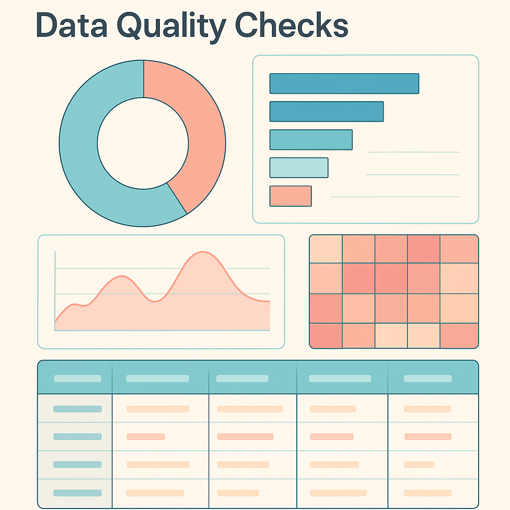

<p align="center">
  
</p>

# Data Quality Sentry

**Automated data quality checks with interactive reports and safe fixes.**


Data Quality Sentry (DQS) is a lightweight framework that scans tabular data, flags issues against a YAML‑configured set of rules, generates beautiful HTML reports, and can optionally **fix** problems safely. It uses familiar tools - Pandas, YAML and Jinja2 - to give you immediate insight into the health of your data without heavyweight infrastructure.

## ✨ Features

- **Duplicate detection**: catch exact row duplicates or duplicates on a subset of columns.
- **Null and freshness checks**: enforce maximum null counts/fractions and maximum record age.
- **Range and enum validation**: define acceptable numeric ranges and enumerated values for any column.
- **Per‑rule failure samples**: export up to 200 offending rows per check for inspection.
- **Interactive report**: sort, search and filter results; see pass/fail KPIs; donut charts for failure breakdown; bar charts for top offending columns; null heatmaps and trend lines.
- **Safe fixes (optional)**: trim strings, drop duplicates, clip out‑of‑range values, enforce enums, fill nulls and parse dates. Guardrails limit the percentage of rows or cells that may change.

## 🛠️ Installation

DQS requires **Python 3.10+**. Clone this repository and install in editable mode:

```bash
git clone https://github.com/MacroAcon/data-quality-sentry2.git
cd data-quality-sentry2
python3 -m venv .venv && source .venv/bin/activate
pip install -e .
```

After installation the `dqs` CLI is available:

```bash
dqs --help
```

## 🚀 Quick start

Run the built‑in sample with safe fixes and visualisations:

```bash
# from the repo root
python run_all.py --source data/sample.csv --out reports_demo --fix --viz on

# or via the CLI (preferred)
dqs run --source data/sample.csv --out reports_demo --fix --viz on
```

Open `reports_demo/<dataset>__<timestamp>__fix.html` in your browser to explore the report. A plain run without fixes can be produced by omitting `--fix`.

### Defining checks

Rules live in **YAML** under `checks/rules.yml`. Each table can have table‑level checks and per‑column checks. Here is a kitchen‑sink example:

```yaml
tables:
  - name: orders
    checks:
      - type: duplicate         # detect duplicates on order_id
        subset: [order_id]
    columns:
      - name: amount
        checks:
          - type: range        # amount must be between 0 and 5000
            min: 0
            max: 5000
      - name: status
        checks:
          - type: enum         # allowed values
            allowed: [new, processing, shipped, delivered, returned]
      - name: updated_at
        checks:
          - type: freshness    # max record age in days
            max_age_days: 7
      - name: notes
        checks:
          - type: null_rate    # max number of nulls or fraction
            max_nulls: 10
            max_null_frac: 0.05
```

See `checks/rules.yml` for the default configuration used by the sample dataset.

## 📊 Output artifacts

DQS writes all artefacts into the directory specified by `--out`. After a run you will find:

- `*.html` – interactive reports with charts and failure tables. The filename encodes the dataset name, timestamp and mode (plain vs fix).
- `*.json` – machine‑readable summaries of all checks (`results`) and fixes applied (`fix_report`). These files include a pre‑computed summary block you can ingest into dashboards.
- `failures/*.csv` – up to 200 sample offending rows per failed check.
- `quarantine/` – rows dropped or values clipped during safe fixes.
- `cleaned.csv` – the cleaned dataset (only when `--fix` is used and changes were applied).

## 🧩 How it’s built

The project combines familiar data tooling with modern developer workflows:

- Validation rules expressed in **YAML**, executed with **Pandas**.
- A straightforward **CLI** with sensible defaults and guardrails.
- Reports rendered as interactive **HTML** using Jinja2 templates.
- A structured **packaging setup** (`pyproject.toml`) for local or editable installs.
- Continuous integration through **GitHub Actions**.

## 🤝 Contributing

Contributions are welcome! Please see [CONTRIBUTING.md](CONTRIBUTING.md) for instructions on setting up your development environment, running tests, adding new rules or fixers, and submitting pull requests.

## 📄 License

This project is licensed under the [MIT License](LICENSE).
